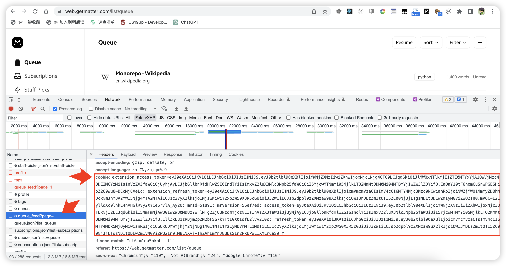

# Omnivore Import Tool

> This is a tools using [Omnivore's](https://omnivore.app/) GQL Api endpoint to initiate a bulk import of data into Omnivore.


# Usage

Step 1: Create a corresponding Python environment and install the necessary dependencies by running:

```
pip install -r requirements.txt
```

Step 2: Modify the environment variables in the `.env` file. You can apply for the api_key on the [API Keys](https://omnivore.app/settings/api) page of Omnivore, and you will need to open Matter's [Web App](https://web.getmatter.com/list/queue) to obtain the matter_cookie.




Step 3: Run your program.

```python
python sync_articles_to_omnivore.py
```

**In theory, this program can help you import any articles that conform to the format into Omnivore. Later, I will provide corresponding instructions.**

# Author

👤 Leetao

Twitter: [@LeetaoGoooo](https://twitter.com/LeetaoGoooo)
Github: [@LeetaoGoooo](https://github.com/LeetaoGoooo)

# Screens

<image src="screens/article%20with%20labels.png" width="300"/> <image src="screens/labels.png" width="300"/> 
